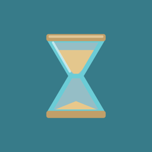

# PullTimer

A macOS menu bar timer. Drag the hourglass down to choose a time, name it, and let the sand run. No Dock icon. No Cmd-Tab.

**macOS 13+** · Apple silicon and Intel · [Website](https://huuphuoc-hcmut.github.io/PullTimer/) · [Download](https://huuphuoc-hcmut.github.io/PullTimer/downloads/PullTimer.dmg)

<p>
  
</p>

## Use it

1. Click the hourglass for the timer list. Drag down to set a duration.
2. Quarter-hours (`:00` `:15` `:30` `:45`) click and hold so they are easy to land on.
3. Drag onto the trash near the Dock to cancel. Release to name the timer and Save.
4. When time is up, snooze +5 / +10 or press Done.

Right-click the hourglass for Settings, How it works, and Quit.

## Build

Needs the Command Line Tools (`xcode-select --install`). From the repo root:

```bash
make run      # debug build, then open
make dmg      # release DMG at website/downloads/PullTimer.dmg
```

The app is an accessory process (`LSUIElement`). After `make run`, look in the menu bar, not the Dock.

## Website

```bash
cd website
python3 -m http.server 4173
```

Then open [http://localhost:4173](http://localhost:4173). The live site is served from this `website/` folder.

## License

Personal project. Free to use.
